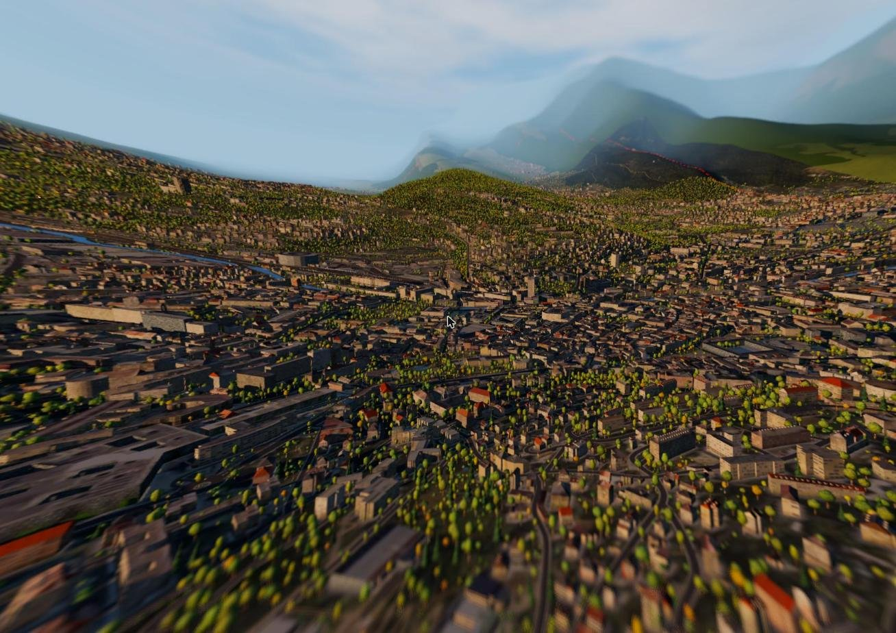
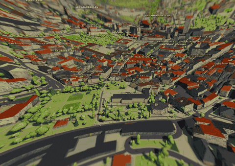
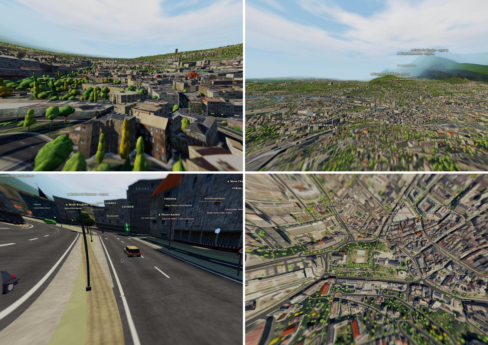
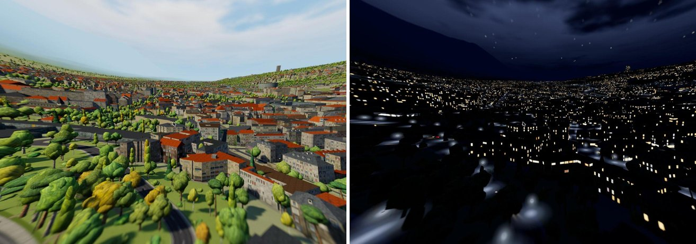
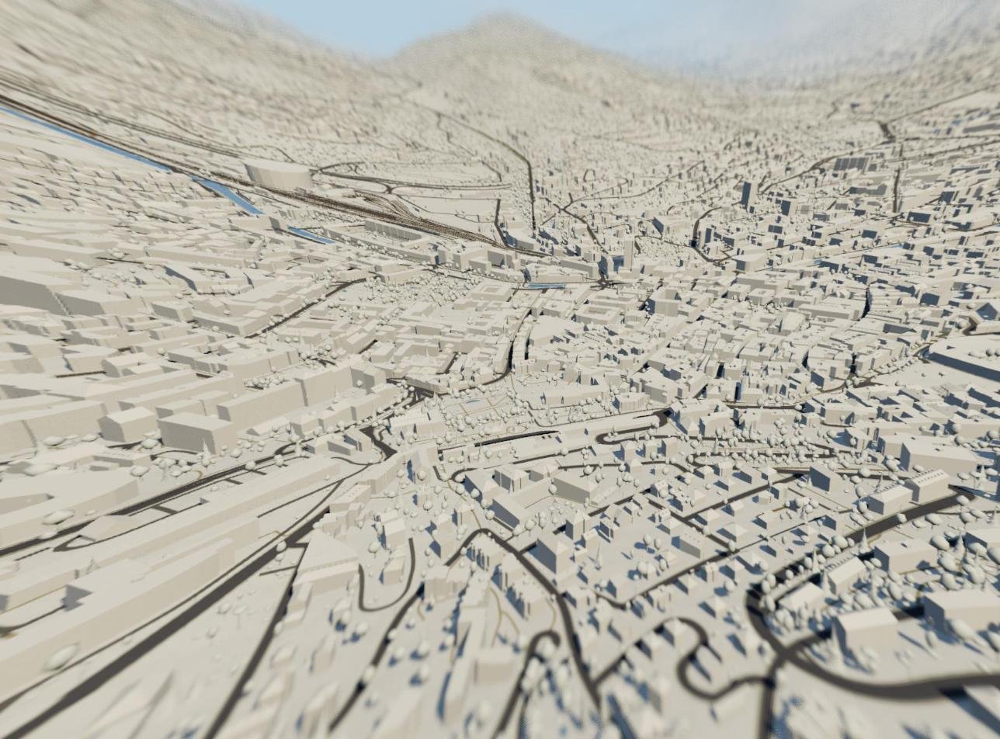
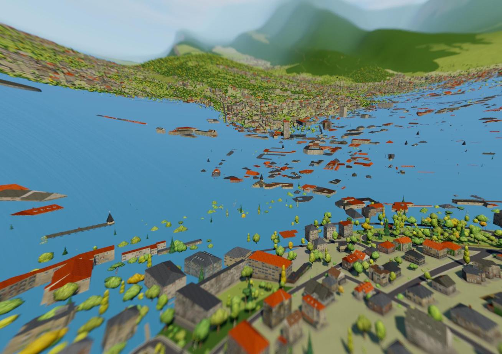
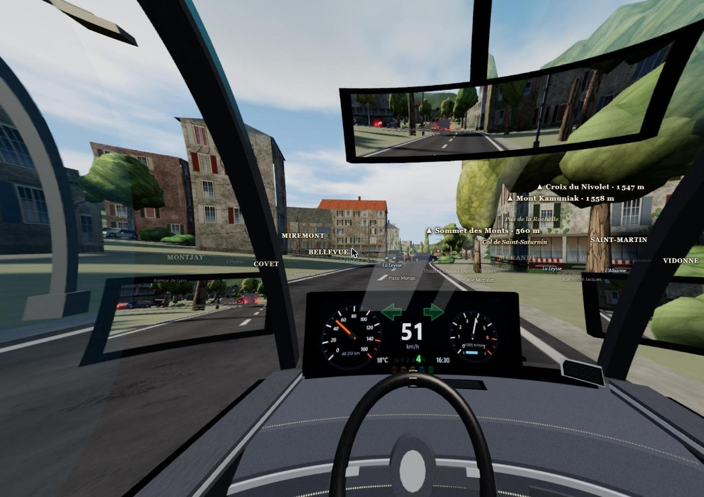
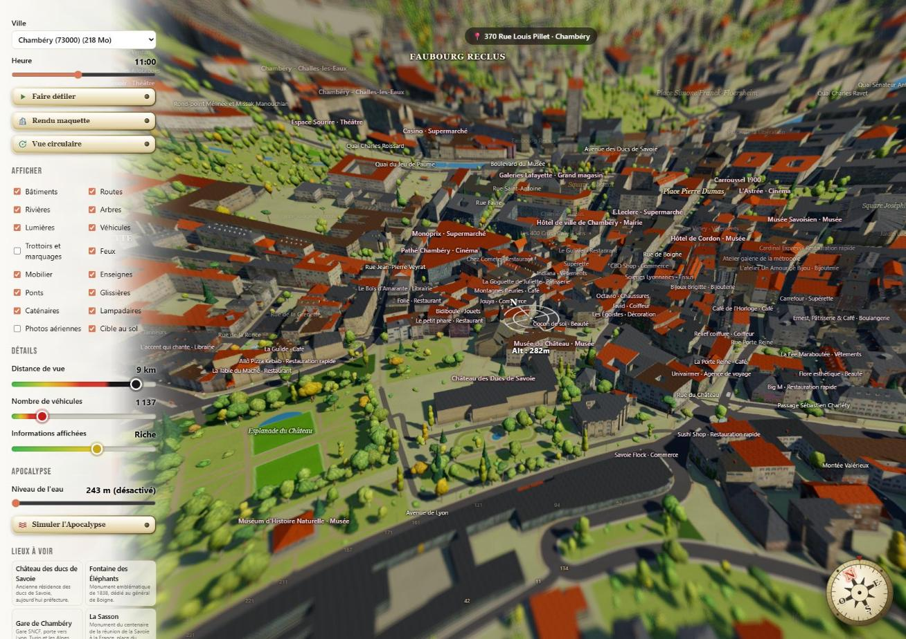
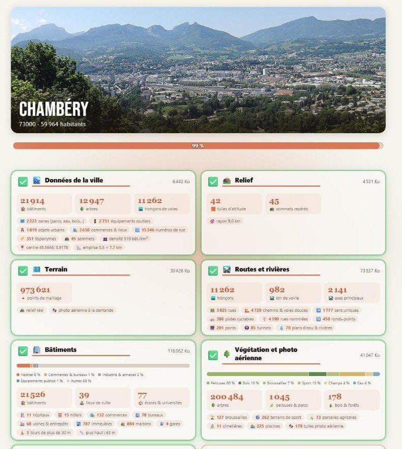
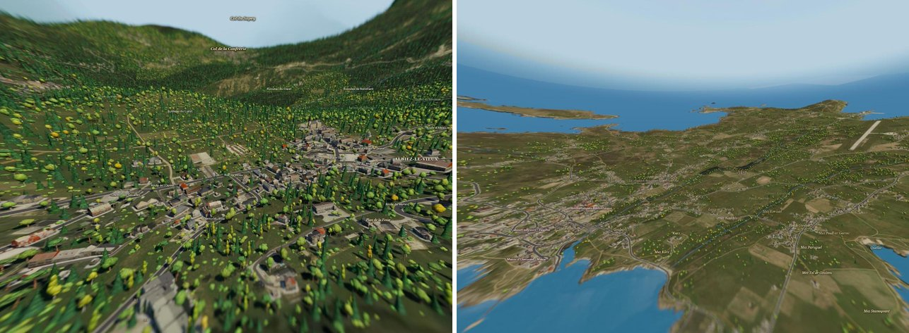

<div align="center">

# 🚗 RtTT — Real Time Town Traffic

**Votre ville en 3D vivante, dans le navigateur**




<sub>Chambéry (73000) — rendu RtTT · données © contributeurs OpenStreetMap, IGN</sub>

### 🌐 [**Démo en ligne → piregwan-genesis.com/laboratory/rtt**](https://piregwan-genesis.com/laboratory/rtt/)

</div>

---

> 🌐 **Une démo tourne en ligne : [piregwan-genesis.com/laboratory/rtt](https://piregwan-genesis.com/laboratory/rtt/)** — aucune installation nécessaire pour l'essayer.

## Le principe

**RtTT** reconstitue une ville en 3D — bâtiments, arbres, routes, rivières, relief — directement à partir de **données ouvertes**, puis la met en mouvement avec la **circulation de milliers de véhicules** : voitures, bus, poids lourds, motos, vélos et même trains.

Choisissez une ville, survolez-la librement, glissez-vous au ras du bitume ou regardez-la du haut des montagnes… ou **montez à bord de n'importe quel véhicule** d'un simple clic, et laissez le temps filer jusqu'à voir le jour basculer dans la nuit.

Il fonctionne sur plusieurs villes et villages très différents (urbain dense, montagne, littoral, île…).

<p align="center"></p>

## ✨ Fonctionnalités

### 🏙️ Une ville reconstituée
- **Bâtiments** extrudés d'après le cadastre et la BD TOPO (hauteurs, toits, types : habitat, commerces, industrie, équipements publics, lieux de culte…).
- **Végétation** : plusieurs centaines de milliers d'arbres, haies, bois, pelouses, parcs, terrains de sport.
- **Relief réel** (plusieurs centaines de milliers de points de maillage) et **photo aérienne IGN** à la demande.
- **Routes, ponts, tunnels, rivières, voies ferrées, glissières, caténaires, lampadaires, mobilier urbain, enseignes**, noms de rues, de quartiers, de sommets, numéros de rue.

<p align="center"><br><sub>Vieille ville · relief et montagnes · rue avec circulation · photo aérienne IGN (© IGN, Licence Ouverte) mapée sur le terrain</sub></p>

### 🚦 Une circulation vivante
- Les véhicules motorisés suivent le **vrai réseau routier** : sens uniques, ronds-points, limitations de vitesse.
- **Modèle de suivi IDM** (Intelligent Driver Model) : accélération, freinage de confort, distance de sécurité.
- **Dépassements** intelligents (les vélos sont doublés par tous, les motos doublent tout le monde), **clignotants** avant de tourner ou de doubler, **feux stop** à chaque freinage.
- **Vélos** sur leur propre réseau (pistes cyclables, voies douces), **trains** sur leurs voies.
- Densité qui varie selon l'heure choisie ; curseur du nombre de véhicules avec avertissement de charge.

> 🚧 *Work in progress* : les feux tricolores, les ronds-points et les priorités à droite ne sont pas encore respectés — c'est pour l'instant un joyeux bazar ! 😅

### 🌗 Le temps qui passe
- **Cycle jour/nuit** complet : ombres portées qui suivent la position réelle du soleil, ciel dynamique.
- À la tombée de la nuit : **lampadaires, feux tricolores, vitrines, fenêtres des immeubles** (chacune indépendamment) et monuments s'allument progressivement ; les véhicules roulent **phares allumés**.
- Mode **« Apocalypse »** : voir [juste en dessous](#-apocalypse--la-montée-des-eaux).

<p align="center"><br><sub>Même vue, 15 h puis 21 h 30 : les fenêtres s'allument une à une, les lampadaires éclairent les rues.</sub></p>

### 🏛️ Rendu maquette
Un bouton **« Rendu maquette »** fait basculer la ville dans un style épuré façon **plan-masse d'architecte** : bâtiments, arbres et terrain en volumes blancs façon maquette d'architecte, sans photo aérienne, noms et repères masqués, lumière de plein jour fixe (le temps est alors figé à 12 h 30), le tout sous un effet de **flou de profondeur « tilt-shift »** qui donne à la ville des airs de maquette posée sur une table. Un second clic ramène au rendu normal en restituant l'heure et les réglages précédents.

<p align="center"><br><sub>Rendu maquette.</sub></p>

### 🌊 Apocalypse : la montée des eaux
Un curseur **« Niveau de l'eau »** (altitude réelle, en mètres) permet de noyer la ville à la main, et le bouton **« Simuler l'Apocalypse »** lance un traveling cinématographique : le temps est figé à 14 h, la caméra tourne autour de la ville et l'eau monte jusqu'au niveau maximal. Les bâtiments, les routes et les arbres disparaissent sous la surface, et la caméra ne passe jamais sous l'eau.

<p align="center"><br><sub>La ville sous les eaux : seuls les points hauts émergent.</sub></p>

### 🎮 Montez à bord ! — vue conducteur
Cliquez sur n'importe quel véhicule pour le conduire… du regard. En voiture, un **habitacle 3D temps réel** s'affiche :
- **Tableau de bord** : compteur de vitesse (0–160 km/h), compte-tours, **rapport engagé** (N, 1 → 5) cohérent avec la vitesse, **clignotants verts**, horloge, kilométrage ; **levier de vitesse** animé en grille en H.
- **Volant à gauche** qui tourne avec les virages, montants, portières et banquette arrière.
- **Trois rétroviseurs en vraie vue arrière temps réel** (miroirs plans géométriquement exacts), avec un coût de rendu adaptatif pour ne pas mettre le GPU à genoux.
- Regard libre à la souris jusqu'à 180° pour regarder derrière soi.

<p align="center"><br><sub>Vue conducteur : les trois rétroviseurs montrent la route et les véhicules derrière en temps réel.</sub></p>

### 🕹️ Caméra et interface
- Caméra totalement libre : zoom, rotation, réglage de la hauteur, **vue circulaire** automatique, « lieux à voir » prédéfinis.
- Interface claire et sobre, **écran de chargement** détaillé (chiffres clés de la ville, avancement par étape), **écran de présentation**.
- Curseurs de **distance de vue**, **densité d'informations affichées** et **nombre de véhicules**, calibrés par ville.

<p align="center"></p>

<p align="center"><br><sub>L'écran de chargement détaille la ville en cours de construction (ici Chambéry : près de 22 000 bâtiments, ~200 000 arbres, 982 km de voirie).</sub></p>

## 🏘️ Villes incluses

Chambéry, Cruet, Montmélian, Arbin, Le Bourget-du-Lac, Saint-Pierre-d'Albigny, Albiez-Montrond, Saint-Amour (Jura), Paris 11ᵉ – Canal Saint-Martin, La Croix-Valmer – Gigaro, Gruissan, île d'Ouessant.
<p align="center"><br><sub>À gauche : Albiez-Montrond, village de montagne et ses forêts de résineux. À droite : l'île d'Ouessant, ses landes, ses côtes et sa piste d'aérodrome.</sub></p>

**Ajouter une ville** : il suffit de la déclarer dans `lib/cities.json` ; ses données sont ensuite récupérées et mises en cache automatiquement.

## 🧱 Architecture

| Élément | Rôle |
|---|---|
| `index.php` | Page principale, interface, écran de chargement |
| `javascript/main.js` | Interface, préchargeur, caméra, vue conducteur, rétroviseurs |
| `javascript/traffic.js` | Véhicules, IA de conduite, itinéraires, signalisation |
| `javascript/cabin.js` | Habitacle 3D, tableau de bord, boîte de vitesses |
| `javascript/roads.js`, `buildings.js`, `vegetation.js`, `terrain.js`, `bridges.js`, `trains.js`… | Reconstitution de la ville |
| `javascript/daynight.js`, `sky.js` | Cycle jour/nuit, ciel |
| `lib/osm.php`, `lib/city.php`, `fetch.php` | Récupération, croisement et mise en cache des données par ville |
| `data/<code postal>/` | Cache des données de chaque ville |
| `CONDUITE.MD` | Document technique de référence (réseau, vitesses, ronds-points…) |

**Pile technique** : [Three.js](https://threejs.org/) r160 (WebGL) côté navigateur, **PHP** côté serveur (testé sous XAMPP), aucune base de données.

## 🗺️ Sources de données

- **OpenStreetMap** (contributeurs OSM, licence **ODbL**) via l'API Overpass : routes, bâtiments, arbres, noms, mobilier…
- **IGN – Géoplateforme** (*Licence Ouverte*) : cadastre PCI, BD TOPO, **orthophotographies**.
- **AWS Terrain Tiles** (Terrarium) : altitude du relief.

## 🚀 Installation

> 💡 Pour simplement essayer le projet, utilisez la [démo en ligne](https://piregwan-genesis.com/laboratory/rtt/). Ce qui suit concerne l'installation locale.

```bash
# 1. Cloner le dépôt dans le dossier web de votre serveur PHP (ex. XAMPP/htdocs)
git clone https://github.com/Krakoukas73/rttt.git rtt
cd rtt

# 2. Récupérer Three.js (copie dans javascript/vendor)
npm install
npm run vendor
```

Puis ouvrez `http://localhost/rtt/index.php?cp=73000` (Chambéry). Le dossier `data/` doit être accessible en écriture par PHP.

### 🛰️ Photos aériennes : dossiers `orthophoto/16` et `orthophoto/19` à récupérer

Pour que le dépôt reste raisonnable, **les sous-dossiers `16` et `19` du dossier `data/<code postal>/orthophoto/` de chaque ville ne sont pas versionnés** : ils représentent à eux seuls environ **300 000 fichiers et 4 Go**. Ce sont les tuiles de photo aérienne IGN, à deux niveaux de zoom (z16 : vue de base ; z19 : haute définition, ~0,6 m/pixel). Le reste du dépôt (bâtiments, routes, relief, etc.) est complet.

Vous avez deux façons de les récupérer, au choix et combinables (les tuiles déjà présentes ne sont jamais retéléchargées) :

1. **À la demande (automatique)** : `tile.php` télécharge chaque tuile manquante depuis la Géoplateforme IGN au moment où la caméra en a besoin, puis la garde en cache dans `data/<code postal>/orthophoto/<z>/<x>/<y>.jpg`. Rien à faire, mais la photo aérienne apparaît progressivement.
2. **Téléchargement en bloc (depuis le réseau local uniquement)** :
   - `http://localhost/rtt/fetch.php?cp=73000` : complète les données d'une ville, dont les tuiles de base z16 manquantes ;
   - `http://localhost/rtt/fetch.php?cp=73000&hires=19` : télécharge le zoom haute définition d'une ville ;
   - `http://localhost/rtt/hires-all.php?z=19` : enchaîne la haute définition de **toutes** les villes, une par une (laisser l'onglet ouvert jusqu'à « TOUT TERMINÉ »).

> ⚠️ Prévoyez de la place (plusieurs Go) et de la patience pour une récupération complète : c'est un grand nombre de petites requêtes vers l'IGN.

> ℹ️ Le premier chargement d'une grande ville est lourd (plusieurs centaines de Mo de géométrie) : un GPU dédié et un navigateur récent (Chrome, Edge, Firefox) sont recommandés.

## 🎛️ Commandes

| Action | Commande |
|---|---|
| Se déplacer / tourner / zoomer | Souris (glisser, molette) |
| Monter à bord d'un véhicule | Clic sur le véhicule |
| Regarder autour (vue conducteur) | Glisser la souris |
| Quitter la vue conducteur | `Échap` |
| Changer l'heure / faire défiler le temps | Curseur *Heure* / bouton *Faire défiler* |

## 🛣️ Pistes d'évolution

- Respect des feux tricolores, des ronds-points et des priorités.
- Habitacles spécifiques (bus, poids lourds, motos).
- Davantage de villes et de modes météo.

## 📄 Crédits

- **Données cartographiques** : © contributeurs [OpenStreetMap](https://www.openstreetmap.org/copyright), sous licence ODbL.
- **Cadastre, BD TOPO et photographies aériennes** : © [IGN](https://geoservices.ign.fr/) / DGFiP, via la Géoplateforme, sous Licence Ouverte.
- **Altitudes** : [Terrain Tiles](https://registry.opendata.aws/terrain-tiles/) (AWS Open Data) — voir leur page pour la liste détaillée des sources.
- **Moteur 3D** : [Three.js](https://threejs.org/) (licence MIT).
- Les images de ce README sont des captures de RtTT ; les fonds de carte et photos aériennes qu'elles montrent restent soumis aux mentions ci-dessus. Merci de les conserver lors de toute réutilisation.
